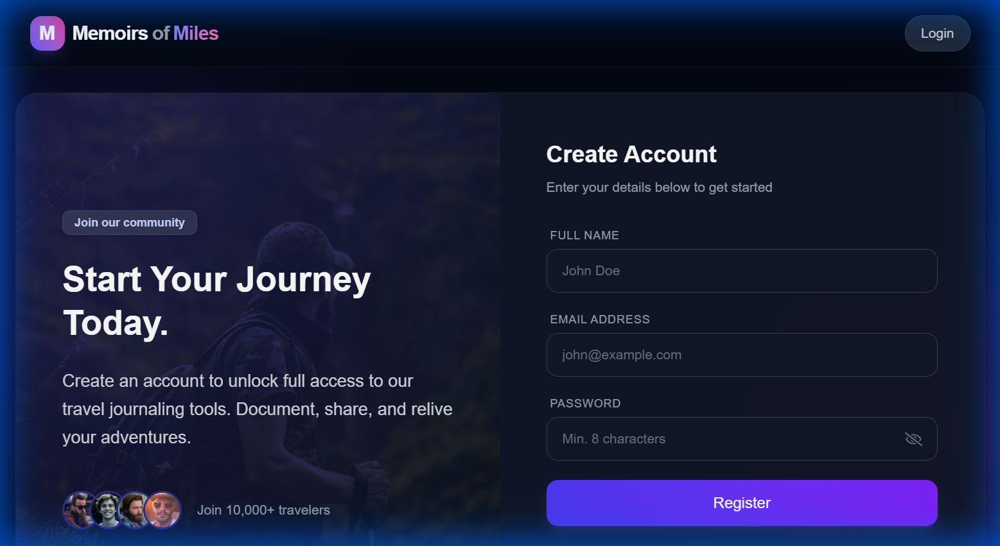
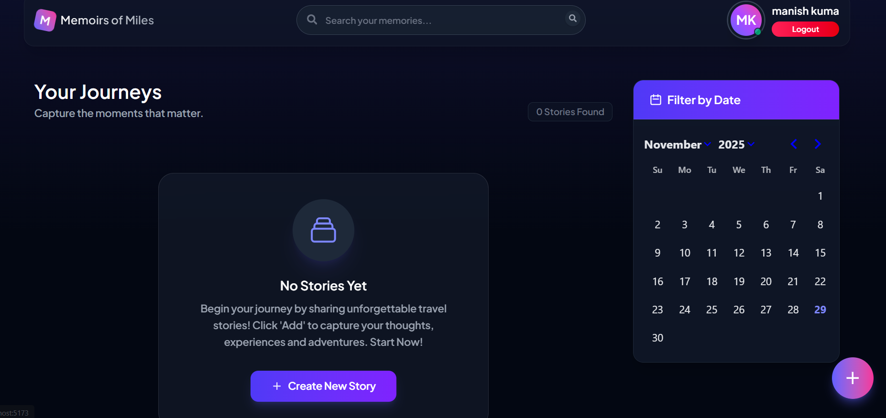
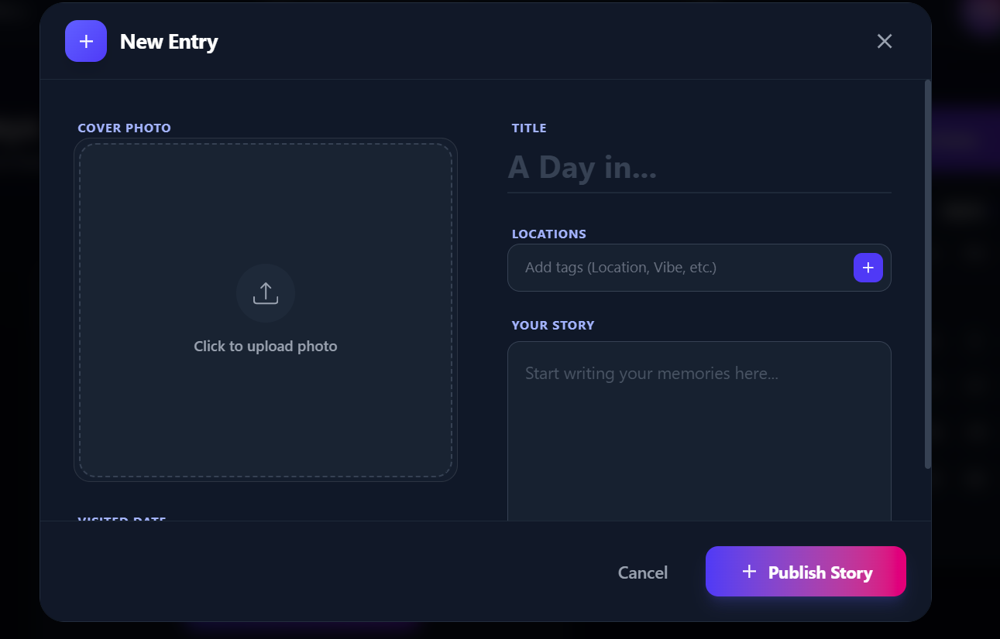

# Memoirs of Miles - Travel Diary App

Memoirs of Miles is a full-stack MERN (MongoDB, Express, React, Node.js) application designed for travelers to document, share, and relive their adventures. Users can create travel stories with images, dates, and locations, and manage their personal travel journal.

## Features

-   **User Authentication**: Secure Signup and Login functionality.
-   **Create Travel Stories**: Add new stories with titles, descriptions, visited locations, dates, and images.
-   **Manage Stories**: Edit or delete existing stories.
-   **Favorites**: Mark stories as favorites for quick access.
-   **Search & Filter**: Search stories by title or filter by date range.
-   **Image Upload**: Upload and store images for each travel story.
-   **Responsive Design**: Beautiful and responsive UI built with Tailwind CSS.

## Screenshots


*Login Page*


*Signup Page*


*Dashboard*


*View Story*

## Tech Stack

### Frontend
-   **React 19**: UI library.
-   **Vite**: Build tool and development server.
-   **Tailwind CSS 4**: Utility-first CSS framework for styling.
-   **Redux Toolkit**: State management.
-   **React Router DOM**: Routing.
-   **Axios**: HTTP client.

### Backend
-   **Node.js & Express**: Server-side runtime and framework.
-   **MongoDB & Mongoose**: Database and ODM.
-   **JWT (JSON Web Tokens)**: Authentication.
-   **Multer**: Middleware for handling file uploads.

## Prerequisites

-   **Node.js**: Ensure you have Node.js installed.
-   **MongoDB**: You need a MongoDB connection string (local or Atlas).

## Installation & Setup

### 1. Clone the Repository
```bash
git clone <repository-url>
cd Travel-Diary
```

### 2. Backend Setup
Navigate to the server directory and install dependencies:
```bash
cd server
npm install
```

Create a `.env` file in the `server` directory with the following variables:
```env
MONGO_URI=your_mongodb_connection_string
JWT_SECRET=your_jwt_secret_key
```

Start the backend server:
```bash
npm start
```
The server will run on `http://localhost:3000`.

### 3. Frontend Setup
Navigate to the client directory and install dependencies:
```bash
cd ../client
npm install
```

Start the development server:
```bash
npm run dev
```
The application will be available at `http://localhost:5173`.

## Usage

1.  Open the frontend URL (`http://localhost:5173`) in your browser.
2.  Sign up for a new account.
3.  Log in to access your dashboard.
4.  Click the "Add" button to create a new travel story.
5.  Upload an image, enter details, and save your story.
